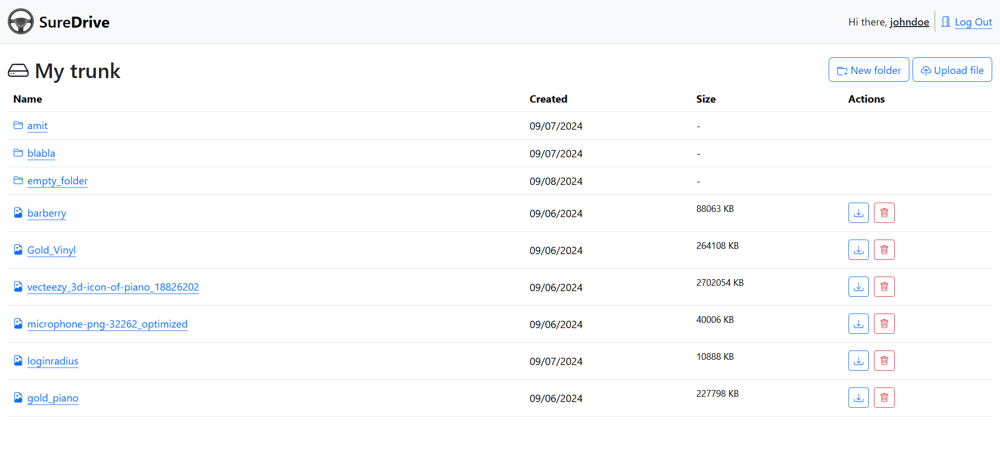
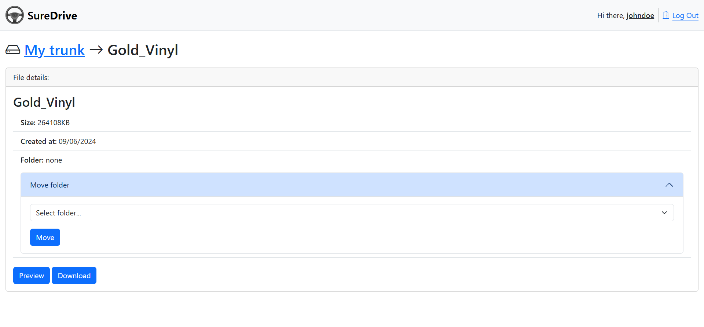
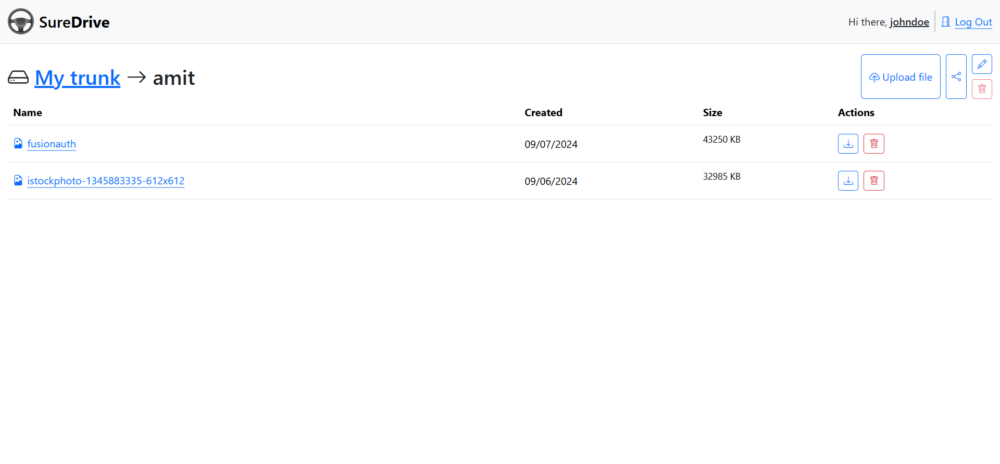

# SureDrive (File storage system)

<p align="center">
  
</p>

SureDrive is a simple file storage system built with ExpressJS, EJS templating engine, and BootstrapCSS. This project allows users to sign up, log in, and manage their files and folders. It uses PostgreSQL for data storage and integrates with Cloudinary for file storage.

## Built with

<a href="https://nodejs.org">
  
</a>
<a href="https://expressjs.com">
  
</a>
<a href="https://ejs.co">
  
</a>
<a href="https://getbootstrap.com">
  
</a>
<a href="https://www.postgresql.org">
  
</a>
<a href="https://www.prisma.io">
  
</a>
<a href="https://cloudinary.com/">
  
</a>

## Features

- **Authentication**: Secure user sessions with PassportJS and Prisma Session Store.
- **Cloud Storage Integration**: Securely manage file uploads and downloads with Cloudinary Storage.
- **Folder Management**: Create, organize, and navigate folder structures with web components.
- Responsive UI with Bootstrap CSS

## Getting started

### 1. Clone the Repository

#### HTTPS

```bash
$ git clone https://github.com/amit-amsl/file-uploader.git
```

#### SSH

```bash
$ git clone git@github.com:amit-amsl/file-uploader.git
```

### 2. Install dependencies

```bash
cd file_uploader
npm install
```

### 3. Set up an account on [Cloudinary](https://www.cloudinary.com/)

Find the cloud name, API key and API secret associated with your account. They will be used as env variables in the next stage.

### 4. Set up environment variables

Create a .env file in the root directory of the project and add the following variables. Adjust the values according to your environment:

```shell
# Server
NODE_ENV=<production-or-development>

# Database
DATABASE_URL=<postgresql://<your-db-username>:<your-db-password>@db:5432/suredrive_app?schema=public>

# Auth
SESSION_SECRET=<your-session-secret-min-32-chars>

# Cloudinary
CLOUDINARY_CLOUD_NAME=<your-cloudinary-credentials>
CLOUDINARY_API_KEY=<your-cloudinary-credentials>
CLOUDINARY_API_SECRET=<your-cloudinary-credentials>
```

### 5. Set up a local development database

Open a terminal and create a new database in psql.

```bash
psql
CREATE DATABASE <your_database_name>;
# Connect to database
\c <your_database_name>
```

Open another terminal, cd to the project's directory and migrate the database schema.

```bash
npx prisma generate
npx prisma migrate dev
```

In the psql terminal, check that the schema has been successfully migrated over to the development db.

```bash
npx prisma migrate dev
```

### 6. Start development server

```bash
npm start
```

The application will be available at http://localhost:3000 by default.
Have fun!

## Tech Stack

- **ExpressJS**: Fast, unopinionated, and minimalist web application framework for Node.js.
- **EJS**: stands for Embedded JavaScript, is a templating engine that allows developers to embed JavaScript code within HTML templates to generate dynamic web content.
- **BootstrapCSS**: popular CSS Framework for developing responsive and mobile-first websites.
- **express-session**: A middleware for Node.js and the Express.js framework that provides a way to manage user sessions in web applications.
- **PassportJS**: flexible and unobtrusive authentication middleware for Node.js applications.
- **Prisma**: Next-generation ORM (Object-Relational Mapper) designed for modern application development with Node.js and TypeScript.
- **Cloudinary**: Cloud based media management service.
- **Socket.IO**: Library that enables low-latency, bidirectional and event-based communication between a client and a server.
- **Multer**: A Node.js middleware designed to handle multipart/form-data, which is commonly used for file uploads in web applications.
- **bcryptJS**: JavaScript library that implements the bcrypt password hashing algorithm. Used to securely hash passwords before storing them in a database.
- **date-fns**: Utility library designed for manipulating and formatting dates.
- **express-validator**: set of middleware functions designed for the Express.js framework, primarily used for validating and sanitizing data received in HTTP requests.

## Screenshots







## Contributing:

Feel free to fork the repository and submit pull requests. Any contributions, whether they’re bug fixes, new features, or performance improvements, are always welcome.
